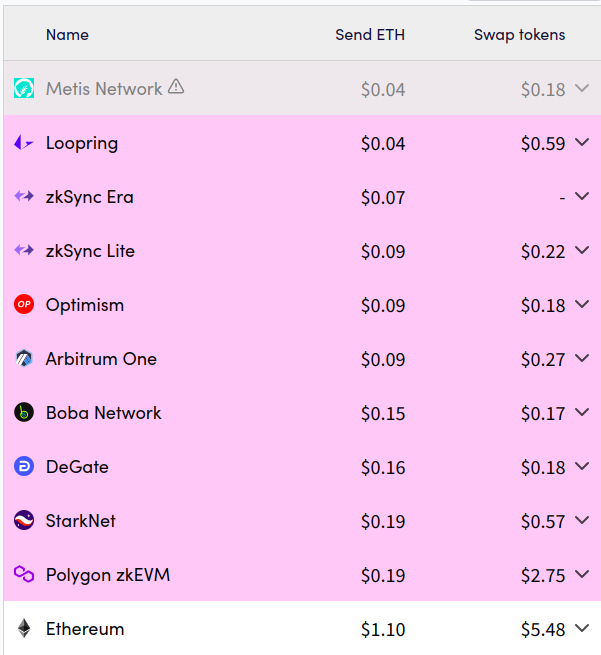

## Monad vs Rollups

Monad 是一个兼容以太坊的高性能 L1 区块链，旨在解决传统区块链的性能瓶颈，其设计目标是实现每秒可
处理 10,000 笔交易（TPS）的吞吐量，并在 1 秒内生成新的区块，提供单时隙最终性。

Monad 正在通过构建超高性能的执行系统和共识机制来提高 L1 区块链性能，Rollups 是一种 L2 扩展解决
方案，通过将交易数据汇总并在主链上进行处理来提高吞吐量和降低费用。相比 Rollups，Monad 有何优势？
为什么不将 Monad 实现为 Rollup？

目前，Rollup 作为一种重要的扩展解决方案，迅速发展并被广泛应用于以太坊生态系统中，与 Rollup 不同，
新秀 Monad 并不依赖于现有的主链，而是通过其独特的并行执行和超标量流水线，直接提升 L1 的性能。

### 去中心化

尽管 Rollup 技术在提升区块链可扩展性方面取得了显著进展，但目前仍面临去中心化区块生产机制的缺
乏。这一问题不仅影响了其抗审查能力，也妨碍了真正去中心化的实现，阻碍了区块链技术的全面应用。
与 Rollup 相比，Monad 旨在通过其独立的高性能 Layer1 架构来增强去中心化和抗审查能力。

### 性能

Monad 正在构建性能最高、成本最低的系统，与 Rollup 相比，Monad 的架构设计使其能够有效地
处理大量数据并实现更高的可扩展性。

### 可移植性

 Rollup 技术在一定程度上增加了迁移的复杂性和成本，而 Monad 的设计理念则强调无缝的可
移植性，允许开发者轻松将现有的 EVM 合约迁移至我们的平台，从而更高效地利用去中心化计算的优势。

### Monad 的设计是性能最高的选择

Monad 的设计旨在提高性能。在执行时，Monad 采用流水线执行，能够在多个核心上合理调度交易，并将
相关的交易安排为连续执行。此外，利用定制的存储后端来加速状态和合约代码的执行，使得执行效率大
大提升。这些改进使得每个 Monad 节点在执行效率上相较于主网节点和 Rollup 节点都极为出色。

尽管这些改进为 Monad 相对于现有的 Rollup 提供了性能提升，甚至可能消除了对 Rollup 的需求，但
敏锐的读者可能会问：“为什么不将这些改进与 Rollup 机制结合，并将 Monad 作为 Rollup 提供呢？”为了
解决这个问题，我们需要考虑在将独立链“转换”为 Rollup 时通常会增加和减少什么。

### Rollups： 减去共识，增加 DA（数据可用层） 依赖

L1 区块链执行影响账户和智能合约状态的交易。L1 区块链使用共识机制使数百个节点彼此同步，强制执
行有关将应用于每个节点的交易的官方排序的协议。与 Rollup 相比，有一些明显的区别：
1、Rollups 没有共识机制，大多数甚至所有 Rollups 都由一个排序器（Sequencer）生成几乎所有的 Rollup 区块。
2、Rollup 在默克尔树（merkle tree）中维护自己的状态，但将数据提交回数据可用性（DA）层（通常是 Ethereum）。
	提交两种类型的数据：压缩的事务数据和汇总 Rollup 状态的周期性默克尔根（merkle root）。
3、Rollup 的证明机制确保默克尔根与按顺序应用交易的结果匹配, 在 ZK-rollup 的情况下，这种证
	明机制是有效状态转换的加密证明（又名有效性证明）。在乐观卷叠的情况下，这是在漫长的挑
	战期内缺乏成功的欺诈证明，而成功的欺诈证明会受到很大的激励。

Rollup 与其 DA 层密切相关，DA 层上的交易顺序正式定义了 Rollup 上的 `true` 状态。这是权衡的
一部分： rollup 排序器（Sequencer）是集中式的，理论上可以随时消失，如果发生这种情况，则需要 DA 层来裁
定 Rollup 上所有资产的所有权。因此，DA 层是真正的权威。

将 Rollup 与独立 L1 进行比较的一个基本心智模型是：Rollup 消除了共识的开销，并以更集中的
方式执行，同时依靠证明机制来强制存储在去中心化 DA 层上的默克尔根正确反映提交的任何交易
顺序的结果。这有几个“好处”：
- 由于不需要直接去中心化，因此排序器（Sequencer）可以在高端硬件上运行，例如具有大量 RAM 的计算机。
- 共识通常占据了很大一部分区块时间，对执行预算造成了严重限制。而具有一个节点的网络没有这样的开销。

同时，不得不接受 DA 层带来的副作用：
- Rollup 继承了将交易数据和默克尔根推送回 DA 层的成本。
- Rollup 继承了 DA 层的容量限制。
- Rollup 继承了 DA 层的最终确定时间。

### Monad：加速共识

相对于 Rollup 减去共识，Monad 采取了不同的方法。Monad 没有从区块链设计中删除共识，而是对其进行
了大量优化，使其不妨碍执行。

Monad 具有新颖的 BFT 算法（MonadBFT）和高性能 p2p 层。此外，Monad 采用模块化设计，节点在执行之前
达成共识；在 Monad 的设计中，执行与共识并行运行，因此可以利用完整的区块时间。这些变化使 Monad 的
高性能共识能够两全其美：共识与执行保持同步，而不是阻碍执行，并且我们不会从 DA 层继承成本或限制。

#### 以太坊数据可用性（DA）伴随着高成本

如果 Monad 是基于以太坊的 Rollup，则提交给 Monad 的交易将产生将 `calldata` 和默克尔根推送回以太坊
的成本。这些成本并非微不足道，[L2Fees.info](http://l2fees.info/)给出了一个比较：

对于 Arbitrum 和 Optimism，简单交换比以太坊主网便宜 20-30 倍。尽管这是一项改进，但 Monad 追求更大的
目标：实现 1000 倍的吞吐量和 1000 倍更低的费用。

#### 以太坊数据可用性（DA）容量有限

将以太坊用于 DA 也意味着继承其数据限制。在当前状态下，`calldata` 每字节消耗 16 gas，因此 15M gas 的
目标区块限制意味着每个区块最多有 937 kb 的数据，即 80 kb/s。在每个事务的平均事务大小为 125 字节的情
况下，这相当于大约 600 tps，远低于 Monad 的执行吞吐量。另请注意，这 600 tps 是所有基于 ETH 的 Rollup 的总和；
Monad 将与所有其他 Rollup 竞争吞吐量。

#### 以太坊的数据可用性（DA）具有较高的最终确定时间

以太坊上的 Rollup 继承了以太坊的最终确定性，由于 Gasper 的设计，它非常缓慢。在以太坊上，Gasper 需要
64 到 95 个时隙来最终确定区块。由于每个槽为 12 秒，这对应于约 15 分钟的最终确定性。同时，Monad 使用
基于 hotstuff 的 BFT 算法（MonadBFT），该算法具有单区块最终性。

具有集中化排序器的 Rollups 声称其快速的“软”最终性，因为排序器知道它计划提交的区块的意图。然而，直
到这些交易被提交到 L1 并且提交被最终确认，这些交易才真正被最终确认。

总之，Monad 不是 Rollup 的主要原因之一是因为 Monad 针对性能进行了优化。不是为了避免开销而取消共识，
而是简单地加速它。

###	Monad 的重点是高性能执行

高性能执行是维护可扩展性和去中心化所迫切需要的，任何人都可以运行的高性能 EVM 执行环境正处于大规
模提高去中心化计算的范围和实用性的关键道路上。

长远来看，区块链是一个去中心化的系统，用于通过无需信任的方式执行交易来维护共享的全局状态。共享全局
状态非常强大，因为它使许多应用程序和资产能够在同一环境中共存，从而实现原子可组合性和快速创新。在去中
心化系统中，计算由许多节点并行完成，这些节点相互检查彼此的工作以确保遵循状态转换规则。这实现了
去信任化，最终使区块链成为连接应用程序的基础。

这项工作的核心是系统用户能够验证计算的属性。这本质上要求区块链软件在计算上非常高效，或者交易吞吐量
受到高度限制，以便用户可以在使用商用硬件的同时跟上链的步伐。

Monad 极大地提高了计算效率，实现了一个支持更多用户和应用程序复杂性的环境，同时仍然允许用户在本地运
行计算。Monad 通过流水线化事务执行（并行运行事务和跨内核调度工作）以及使用自定义后端大规模改进合约
和状态存储来实现这一点。这些效率提升来自算法改进，而不是对硬件的依赖。

任何区块链（Rollup 或其他区块链）都需要专注于提高执行吞吐量，这是因为维护 Rollup 状态的唯一方法是
跟上每个 Rollup 区块并执行所有交易以进行增量状态更新。 Monad 专注于执行吞吐量，通过构建超高性能的
执行系统和共识机制来提高 L1 区块链性能，以推动 EVM 向前发展。

