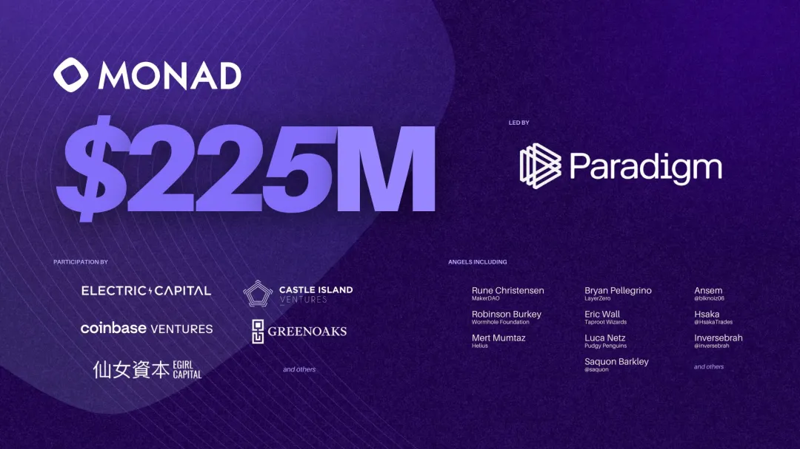

Keone Hon于2004年至2007年就读于菲利普斯埃克塞特学院。完成高中学业后，Keone随后于2007年至2011年在麻省理工学院（MIT）攻读计算机科学和数学理学学士学位（B.S.）。在此期间，Keone还于2010年至2011年在麻省理工学院完成了计算机科学工程硕士（M.Eng）学位。此外，2010年至2011年，Keone还在麻省理工学院攻读金融硕士学位。

Keone Hon的职业生涯始于2011年，起初担任Getco LLC的量化交易员。2013年，他加入了Jump Trading, LLC，出任量化交易团队的负责人。在此期间，他主要负责领导高频交易团队，通过策略优化和机器学习技术进行价格预测研究，全面提升交易表现。2021年，Keone转战Jump Crypto，成为量化开发人员，继续在量化领域深耕至2022年。如今，Keone是Monad Labs的联合创始人兼首席执行官。Monad Labs专注于优化以太坊虚拟机（EVM），致力于通过技术创新突破EVM性能瓶颈。

Monad Labs 在2024年4月9日完成了最大的一轮加密融资，筹集了 2.25 亿美元。
Keone 分享了他从量化交易员到领导 Monad Labs 在短短两年内从零成长为独角兽的宝贵经验。

### 介绍下你自己

Keone：成立Monad之前，我是量化交易从业者，在量化团队这段经历里，我学到不少，做量化交易，你都是在跟数字打交道，在处理一些大数据时，我们也会用机器学习（ML）获取一些比较准确的短期价格预测，搭建量化交易系统。这些都让我受益良多，另外从交易者的角度，在这个岗位上，做决策必须要果断，比方说，做风险管理方面的决策时，你得能够接受极端后果，比如一下子亏损了超大一笔钱。我觉得这些都是收获，对CEO来说，或者往大了讲，在创业公司如果需要做决断，这些经验也大有好处。

### 是什么吸引你进入加密行业

Keone：其实在2021年，当时量化团队跟加密团队合并之前，我们就已经在交易一些加密货币了，这些经验也很宝贵，因为加密货币本身具有极强的不确定性，所以机会特别多，有很多各种各样的交易选择。因为交易所当时技术受限，所以也有很多谜之操作，不完美也意味着有很多机遇。我在量化团队做了大概一年多的加密货币交易，后来并入到Jump的加密团队，现在回头看，在Jump加密团队工作这段时间算是一个很好的过渡期，因为这段时间里，我的工作重心从原来的交易转到了做研究和写代码，不是交易系统的代码，感觉更像是在搭建一个产品。我待了近六个月，然后意识到与其在这里做这件事，不如all in进这个行业，做一些能实打实影响到行业发展的事情。

### 说到高频交易，不管是在Jump Trading、Jump的加密团队还是在Monad，为什么在金融市场上，高频交易占有如此重要的地位

Keone：高频交易的概念就是用自动化系统，按照稳定的策略，做持续交易，只要开市，就能交易。与之相对的概念是，依靠人工下单去交易。如果让人去手动做市，那市场就会有很大波动，依靠人工去定价肯定不如电脑精确，人工处理总会存在着无法避免的“蒙混因素”，比如在报价方面，或者面对新信息的识别以及反应能力。

做市终归只是一项生意，一门服务。任何公司，对原材料的处理效率越高，装配效率越高，产品的价格就会越低，用户就能从中受益。这样吧，我们换个角度，抛开高频交易这个概念，大家想一想厕纸的加工制作，如果只能通过手工的方式去制造厕纸，手工厕纸的价格肯定是机器做的好几倍。高频交易也同理，我们通过自动交易系统代替了以前的人工做市，这样一来，效率得到了很大提升，价差变得更小，流动性也会更好，所以交易的成本，根本上来讲，投资的成本就大大降低了，对终端用户来说是件大好事。

### 所以说高频交易在传统金融领域已经是如鱼得水了，那老实说，目前加密领域的交易效率是什么样的呢

Keone：现在链上的效率还是挺低的，我们先退一步，从整体上看，把效率这回事分成三个层级，目前传统的中心化金融处于最高层级，也就是像纳斯达克或者CME这样的市场，传统金融市场处理传统金融资产，这是最为高效的。然后来到第二层级，也就是中心化交易所处理加密资产，最后来到第三层级，也就是在去中心化交易所进行加密资产的买卖。

所谓的效率，跟用户的交易成本是成反比的，效率越高，成本越低。这样效率低下的原因在于技术上的受限，做市商的单笔交易成本很高，因为这种成本越高，做市商的报价更新频率就会越低，从而影响到报价的准确度。

### 用简单易懂的话解释一下什么是Monad

Keone：Monad是一条超高效区块链，在效率和兼容性两者之间都能达到极致，开发者们用Solidity建设的所有成果，EVM上的那些智能合约，我们想让这些成果都能够从更多成本更低的交易当中收益，最终目的是为了让开发的产品能够得到广泛的实际采用。

### 为什么用户需要Monad，要知道现在已经有那么多L1在用不同的架构去尝试建设不一样的东西了

Keone：Monad有自己的独到之处，我们想把并行处理这个功能以及其他优化后的高效基础架构带进EVM，让整个系统得到进一步发展，从而让基于Monad链上的应用，那些去中心化的应用能够得到大规模的实际运用。打个比方，比如你想在苹果的App Store上打造一个爆款应用，那么你这款应用需要能够承接上百万日活用户。咱们可以算一下，假如你一百万日活用户，每个用户每天发起50项交互，而你每天就有五千万交互要处理，平均大概每秒需要处理五百多个交互。目前来说，没有哪条EVM L1可以做到这一点。所以光是那一个应用，就是那个一百万日活用户的应用，每人每天50条交互，就是以占据目前任意一条EVM区块链的全部吞吐量。

Monad想要解决的就是整个问题，通过并执行和其他改善方式实现一万TPS，也就是每天能支持10个亿的交互，为产品发展铺路，收获越来越多的用户。

### 能简单解释一下什么叫并行吗，毕竟你刚刚说这是个新概念，其他L1都没有做到并行

Keone：现在的电脑，其实都是并行处理任务。大家其实都有很直观的感受，因为你电脑的浏览器，比如谷歌Chrome可能同时打开了50个网页，你的电脑可以一边播放spotify上的音乐，一边处理你在word文档上的文字。所以并行处理这件事，在电脑上已经是理所当然的事情。但是对于以太坊以及其他跟以太坊兼容的区块链来说，并不是这样，大家都是单线，也就是说一个交易结束之前，新交易只能排队等着，这个效率实在是太低了。

### 为什么当初这些区块链会这样去开发

Keone：以太坊的存在时间其实并不算长，虽然在加密行业，感觉它已经存在很久了。实际上，以太坊大概是从2015年开始，那个时候其实并没有太多的用户，交易量也不大，这种情况一直持续到2020年DeFi Summer那个时候，链上的资本开始初具规模。所以说，这个风险市场其实直到前几年才真正开始发展，想要最终抵达理想中的架构，效率流程上的改善就需要很多年时间。

### Monad 拿到2.25亿美金的融资，你们准备怎么花这笔巨款

Keone：我有时也在想这个问题，我们团队肯定会继续像之前一样，开销方面保持谨慎，做事前想清楚回报率，开销方面肯定还是会保持原先的做法，在之前团队规模更小的时候，这里我想强调一下，身处这样一个行业是我们的幸运，因为这里的资金很充裕，在这次大额融资之前，团队已经拿到九千万了，对于一个常规的科技创业公司来说，已经是一份不可多得的资源。所以不管是过去还是现在，我们对这份优势地位都心怀感激。

过去我们对所有开销都是一贯的谨慎，比如我们举办的side events，尽量避免那些大手大脚的party，有活就自己解决，尽量避免外包给第三方。我觉得这些习惯在日后也将让我们一直受益。

我还想补充一下，在加密行业，市场营销跟社区运营是一码事，或者说，社区运营是一种高效的市场营销方式。你可以看到现在市场上有很多无效营销，我认为在加密行业，只有社区建设这一条路算得上是成功的市场营销。社区的好处在于其中的灵活性和韧性，你可以畅谈自己的愿景，为什么这个项目很重要，跟大家分享项目细节，但你不需要呈现一个做好的项目或产品，用户都理解这一点。加密行业的社区是一个非常棒的地方，有很多人会关心项目，即使这个项目暂未上线，还不完美。在传统的科技行业，宣传新品上线时，你可能会在推特上去发一条宣传文案，然后收获2个赞，这仅有的2个赞，一个是你老妈点的，另一个来自你的狗，传统科技行业很少能像加密行业这样收获社区的很多支持，可能只有苹果除外，再加个特斯拉。

总之能拥有这样一个强大的社区，这么多用户对去中心化技术等各种有意思的东西充满热情，对各种新鲜事物充满热情，我们还有什么理由不去努力建设社区，让社区成为项目前进的重要一环呢。所以我觉得每一个项目都是同样的，肯定会有部分用户只为了经济利益而来，还有部分人，他们可能一开始是奔着空投来的，但是有些人会意识到在参与社区建设的过程中，你会收获除空投之外的其他一些东西，比如很多乐子，比如有很多人会跟那些与自己有着相同爱好，类似经历的网络陌生人成为朋友。

我还觉得这个事情是这样的，交到好朋友这种事，你不可能用一个优化算法去把你碰到的这些人用算法跑一遍，从中选出那个有着所谓“好朋友”标签的人。在真实世界里，你碰到谁就是谁，人与人之间的真实交往才能发展出友谊，创造共同话题，留下共同经历的回忆，大家一起成长，所以我觉得一个好的社区也应该是这样的，大家一开始互相不认识，甚至一开始就是冲着Monad来，因为听说这个项目前景不错，但是到了后来，有些用户就会沉淀下来，因为他们收获了不少快乐，这一点是很有感染力的，会吸引到其他人不断加入进来。因为，其实加密货币就像一个纽带把大家聚到一起，但你刚走上这条路时可能是孤独的，很多独立的小个体都希望成为大团体的一部分。

### 对于那些支持你的人，你有什么想说的吗？包括那些在项目出名之前就在支持你的人

Keone：对大家的信任和支持，我非常非常感激。每天我看到那些玩笑、各种创意作品，都笑得合不拢嘴，我知道这样听起来很难让人信服，毕竟在咱们这个场合下只能用嘴上说的，没有办法去展示那些绝妙的艺术创作。但是如果听众感兴趣或者不相信，直接上我们的Discord或者推特上看就是了，你会看到大量的“紫色作品”。我记得有些用户会创作漫画，社区会自发组织卡拉ok之夜。大概是上周末的时候，可能有300来号人在线，很多人都在排队等着为大家唱歌。我们还有德州扑克，这个活动上限就是300人，这个活动在社区每次都是爆满，过去4，5个月都是这个状态，打牌的时候大家还会开语音，期间还有一名DJ，他也是社区成员，也会在打牌期间给大家表演助兴，就各种精彩活动，实在是太多了，而且活动是完全去中心化的，这些优秀的社区贡献者都来自世界各地。

