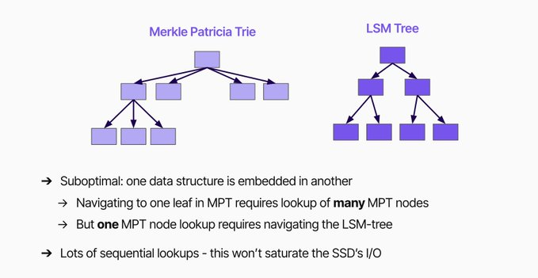
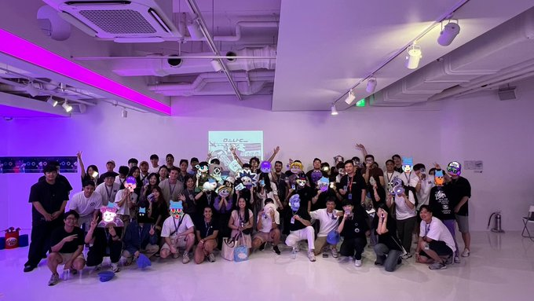
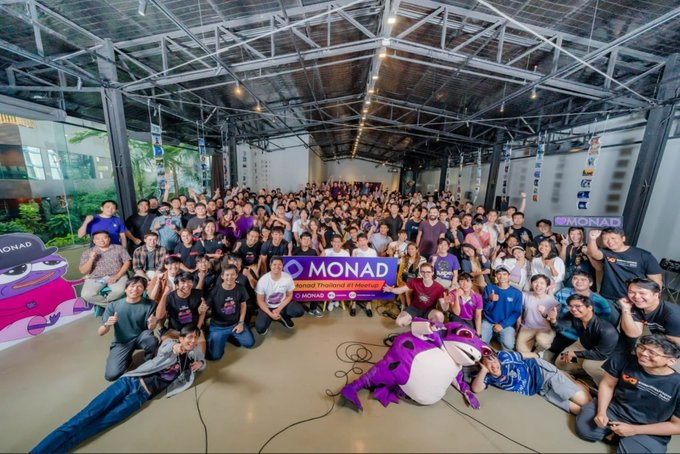

# 探究 Monad：五个 W 问题——Who、What、How、Why、When

原文：https://x.com/cryptunez/status/1865077152623788354

第 1 部分：谁?

Monad 由前 Jump HFT 做市商创立，他们经营一个交易团队十年，在传统市场每年的交易量为 1T 美元。然后他们继续管理 Solana DeFi 团队。这种人才在加密货币领域非常罕见。在过去的 3 年里，Monad 聘请了顶尖人才来解决非常棘手的问题，目前团队中的顶尖工程师已接近 40 名，其中许多开发人员在 HFT/MM 方面拥有丰富的背景。

Monad 无疑拥有加密货币领域最优秀的团队之一。

第 2 部分：什么

Monad 的正确思维模型是 Solana 是否与 EVM 兼容。

目前，虽然以太坊和 Solana 争夺用户，但由于这两个区块链具有不同的编码语言，因此它们争夺开发人员的情况更为罕见。过去 1.5 年的主要讨论是 Eth 与 Solana。 Eth 人士认为，Layer-1 区块链的正确设计是成为其他区块链汇总的大本营。这使得以太坊能够最大限度地保持去中心化，同时使资产 ETH 在许多不同的第 2 层区块链中激增。对于 eth maxis 来说，这是 eth 成为“货币”的最佳路径。

Solana 人认为以太坊的设计是错误的，而 Layer-1 区块链的目的只是为了服务用户。这里的权衡主要是 Solana 的去中心化程度明显低于以太坊，但 Solana 的人会认为去中心化的回报递减，而以太坊可能过于去中心化

Solana 优先考虑性能而不是去中心化。以太坊优先考虑去中心化而不是性能。这基本上是 Vitalik Buterin 最初提出的“扩展三难”的象征。

Monad 的特别之处在于，它可以说是解决三难困境的方法。 Monad 比 solana 具有更高的性能，但在某种程度上能够更加去中心化。

性能方面：Solana 的峰值约为 6,500 TPS。 Monad 将能够处理 10,000+ TPS（以以太坊 L1 历史为基准）。我强调以太坊基准很重要，因为通过运行不切实际的模拟来衡量区块链能够处理的内容，很容易在 TPS 上撒谎和欺骗。大约有 100 个不同的区块链承诺能够处理 100,000+ TPS（包括以太坊和 solana），但没有任何一条链能够接近。

您可以在这里阅读有关 TPS 技巧的更多信息：monad.xyz/wtf-is-tps

关于去中心化：Monad 将由数千个节点运行，分布在世界各地，运行成本约为 1,000 美元。 “作弊”和中心化的常见方法是让您的节点花费大量资金来运行、拥有少量节点、让您的节点全部位于同一个城市……并且在大多数情况下，这三者皆有。 Monad 不采取任何措施这些快捷方式。节点将变得廉价、丰富且广泛。

基本上，Monad 所承诺的，相当于区块链的圣杯。真正去中心化的高性能第一层区块链。让它变得更好的是，它完全 1:1 EVM 兼容（无附加条件），这使得任何 EVM 构建者的开发体验与他们习惯的完全相同。

这听起来好得令人难以置信。但这就是炒作的全部内容。当然，你应该持怀疑态度，但 Monad 已经详细说明了它是如何构建这个东西的（目前位于私人测试网中）。

第 3 部分：如何

这会有点技术含量，但我不是开发人员，也不懂技术，所以它应该相对容易理解。

Monad 完全专注于处理尽可能多的事务。

首先，Monad 进行异步执行。这在实践中意味着共识和执行是分开的。这很重要，因为共识通常会占据您执行预算的绝大多数（执行预算 = 完成更多 TPS 的能力）仅此一项技巧就可以极大地提高您的 TPS。

其次，Monad 进行并行执行。这在实践中意味着多个事务可以在同一时间发生，只要它们不触及同一个状态。如果我向您发送 10 美元，而 cobie 向 GCR 发送 1000 万美元，那么这些交易可能会同时发生。这不是当今大多数区块链的工作方式。

第三，Monad 构建了 MonadDB，这是一个从头开始的自定义数据库，针对并行执行进行了优化。这在实践中意味着 Monad 构建了新版本的 Excel 电子表格来跟踪每个人的余额。区块链非常简单，因为它们主要只是帮助转移资金。区块链的“状态”本质上是使用该区块链的数百万人的当前余额。如果您希望您的链能够处理 10,000 TPS，它需要能够以光速更新状态（优于电子表格）。今天的每个区块链本质上都使用商品数据库来存储状态。这是极其低效的。

当您将这 3 者（异步执行、并行执行 + 自定义数据库）结合起来时，您将获得非常强大的功能。这 3 个功能结合起来可以极大地提高性能。

接下来出现的问题是共识，世界各地的所有节点必须就区块链的状态达成一致。这会严重减慢速度。因此...

第四，Monad构建了MonadBFT。这是 2-Phase Hot Stuff 和 DiemBFT 的衍生品，经过额外改进，允许世界各地的数千个节点以 10,000 TPS 的速度传播数据。

是的，Monad 实现的所有性能都是惊人的，但是当你考虑到这个东西实际上是非常去中心化的，它就变得非常特别。当您添加它将与 EVM 1:1 兼容时，您就创造了范式转变的机会。

您可以在此处阅读 monad 文档以获取更多信息：docs.monad.xyz

第 4 部分：为什么

过去四年的故事就是 Solana。尽管 FTX/SBF 带来了很多有毒包袱，但 Solana 仍然是当今最常用的链，原因很简单：它提供了良好的用户体验。

目前，以太坊确实很难在这一人人都关心的用户体验的通用属性上与 Solana 竞争。

Solana 的理念是用户，而以太坊的理念是碎片化。以太坊正在玩一场非常冒险的游戏，因为它愿意在短期内输给 Solana，以试图在长期与比特币竞争。

这里真正的风险是，如果 Solana 在用户获取方面取得足够大的领先优势，以太坊（及其 1,000 个 L2）可能永远无法缩小差距。

Enter Monad.

过去 4 年来，市场基本上一直在尖叫着想要 Solana。即将上任的加密货币沙皇甚至是 Solana 的大型投资者，你可以预期，所有这些细微差别实际上都会被即将上任的政府深刻理解。

以太坊相对于 Solana 的优势在于其网络效应。以太坊已经存在 10 年了。以太坊也有更好的开发体验，并且有更多的开发人员。但这主要只是 EVM 的一个属性。

还有很多其他的链出现了，基本上都是说“嘿，在我们的 EVM 上构建，我们比 ETH 更好”，但实际上这些链只是采用以太坊并使其变得极其中心化以获得性能。这里我想到了BNB。 BNB在市场上占有一席之地，但每个使用BNB的人都知道存在中心化风险。我想我们只是信任 CZ，或者任何运行这些节点的人。虽然现在这种方法有效，但我真的不认为这是长期的制胜策略。这个模型只是把 web2 放在区块链上。有什么意义？

Monad 代表了一种鱼与熊掌兼得的愿景。您可以同时拥有非常高的性能和非常高的去中心化。

这一愿景呈现给所有 EVM 构建者，他们已经注意到 Monad 有数百个团队致力于在主网上进行部署。

但在主网之前，我们需要一个测试网。

第五部分：何时

退一步来说，Monad 是一个前所未有的极其雄心勃勃的愿景。花费数年时间建造这样的东西需要极高的技术能力和坚定的信念。对 Monad 的常见批评是它的发布时间太长。您可以从中得出两个不同的结论。

结论A：Monad 拥有加密领域最强大的团队之一，在高频交易方面拥有广泛的经验，但不知何故无能，这个东西从未推出。

结论 B：伟大的事情需要时间，很荣幸有这么多聪明人花了这么多时间解决如此困难的问题。

事实上，之前没有人尝试过创建 Monad，因为他们要么认为这是不可能的，要么意识到在这个行业有无数更简单的赚钱方法。是的，这需要时间，但有充分的理由。

许多团队已经加入私有测试网，而公共测试网即将到来，并且很快就会到来。

TL;DR 长话短说

Who - Cracked devs ex-jump + HFT/MMs

什么——区块链三难困境已解决

如何-创新（异步执行、并行执行、MonadDB、MonadBFT）

Why - Bring the best user experience possible to the EVM (Performance + Decentralization)
为什么 - 为 EVM 带来最佳的用户体验（性能 + 去中心化）

When - Soon. Gmonad 💜
当——很快。Gmonad💜

您可以在这里加入社区：discord.com/invite/monad

此外，如果您有兴趣在 Monad 上进行构建，您可以在这里加入开发者社区：discord.com/invite/monaddev
