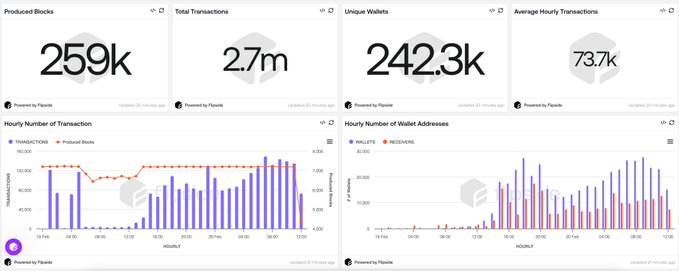
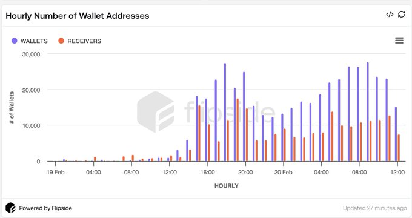
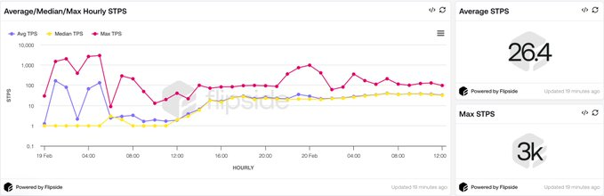
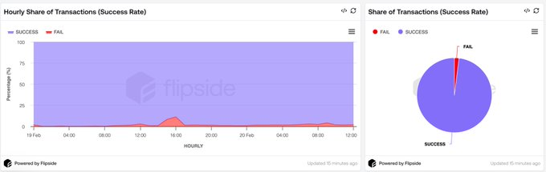
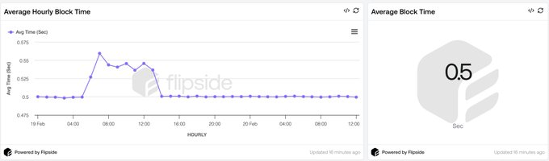
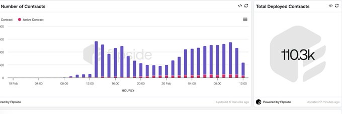
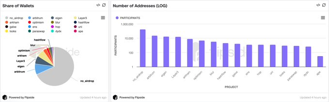
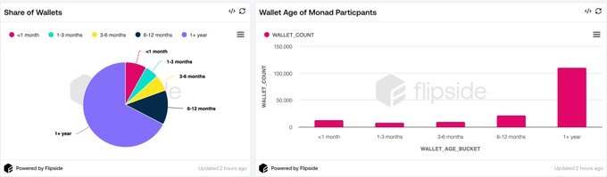
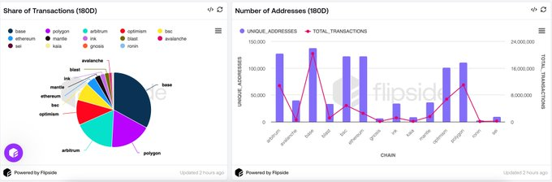

# Monad 测试网首日表现：一览链上关键数据

作者: Hess
来源：https://x.com/0xhess/status/1892577920864113068

Monad 的公共测试网已于2月9日下午11时上线，截止2月20日下午11时，已经处理了近 270 万笔交易，有 242.3 万个钱包地址参与交易，成功率为 98％，时间为 0.5 秒。可以在这里查看详细数据：https://flipsidecrypto.xyz/hess/monad-public-testnet-gHqawFb

在最初的几个小时内，Monad 顺利处理了每秒超过3000笔交易的峰值请求。

接下来，我们将深入分析这些数据，探讨 Monad 测试网上线首日的表现以及其对未来发展的潜在影响。

根据 Monad 创始人 Keone Hon 的说法，他们向近 880 万个活跃的以太坊地址发送了测试网代币（https://x.com/keoneHD/status/1892243281620169037）。 在不到 24 小时内，其中3%的地址已经在 Monad 上完成了他们的首笔交易。 这些数字正在逐小时增加，并且很快可能达到10%。

测试网代币的分发（领水）导致交易速度（TPS）显著增加。 仅在两小时内，Monad 就处理了平均每秒3000笔交易的峰值请求。

目前，Monad的平均每秒交易数（STPS）为 26。

交易成功率表明 Monad 位于成功率最高的区块链之列。 在公开测试网首日，Monad 网络的交易成功率达到近 98%。

区块时间是 Monad 在启动前的关键关注指标之一。 现在，在测试网首日，Monad 的平均区块时间为 0.5 秒，使其成为最快的区块链之一。

自 Monad 测试网上线以来，已部署了将近 11.03 万个合约。 平均每小时有 5000 到 6000 个新合约被部署，其中 500 个合约处于活跃状态。

当前在 Monad 测试网上完成首次交易的地址中一个有趣的点是，大约 77% 的地址没有从流行的链和平台收到任何空投。 其中最大的份额来自 Arbitrum、Eigen 和 Layer3 的空投地址。

根据任意 EVM 链上地址的首次交易数据，我们可以看到，总地址中有 67% 的地址已激活超过一年。 其中 8% 的地址激活时间不足一个月。

Monad 参与者在过去六个月中最活跃的链是哪些？ Base、Polygon 和 Arbitrum 是 Monad 参与者最活跃的前三个链。

