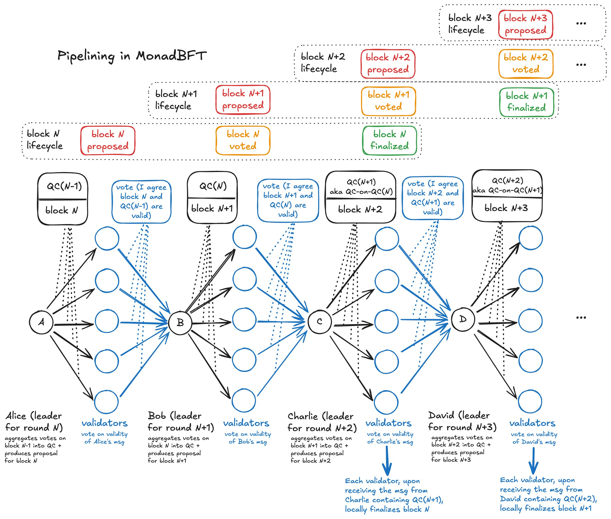
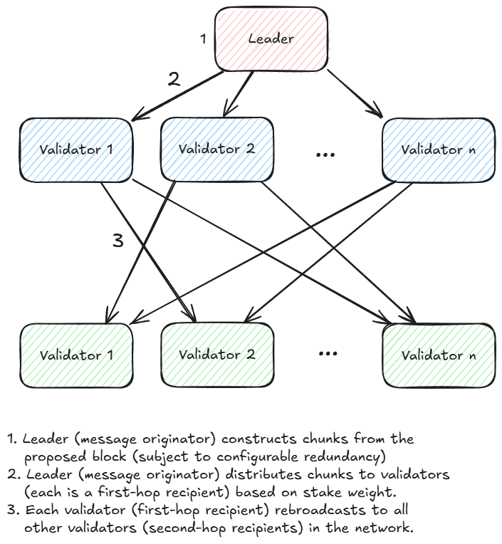
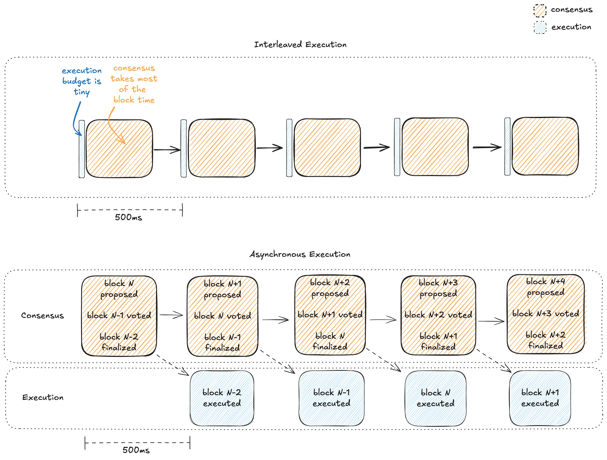
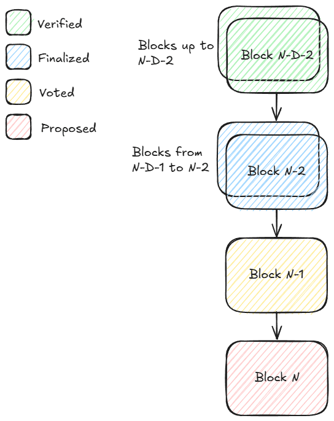

来源：https://x.com/keonehd/status/1891738830534766710

# Monad 是如何工作的？

## 摘要

- Monad 与 EVM 字节码完全兼容（你可以直接部署字节码而无需重新编译）
- 支持 Cancun fork (TSTORE, TLOAD, MCOPY)
- 操作码的 gas 消耗与 Ethereum 相同（例如 ADD 是 4）
- RPC 接口与 geth 的 RPC 接口规范完全兼容
- 每 0.5 秒产生一个新区块
- 最终确认在 1 秒内完成；区块 N 的最终性在区块 N+2 被提议时达成
- 测试网的区块 gas 上限为 1.5 亿 gas，即网络吞吐量达到每秒 3 亿 gas。该值将随时间逐步提升。
- 预计共识机制中将有 100-200 个验证者节点参与
- 测试网上线的第一天，Monad 就将拥有约 55 个全球分布的验证者节点
- 低成本 / 对去中心化的影响

Monad 的核心目标是通过改进共识算法和执行算法，在保持去中心化的同时实现高性能

这些算法使得节点在相对普通的硬件配置下就能实现高性能：

- 32 GB 内存
- 2块2TB的SSD固态硬盘
- 100 Mbps 网络带宽
- 16核4.5 GHz处理器（例如AMD Ryzen 7950X）

仅需约1500美元，你就可以组装一台节点机器

这些算法在保持验证者节点完全全球化分布和权益权重合理分配的前提下，仍能实现高性能

Monad不依赖特定地理区域的绝对多数节点——这看似是基本要求，但许多"高性能"Layer1实际上正是通过让权益权重高度集中的节点群在物理位置邻近来实现其性能表现

## 节点

Monad 节点包含三个核心组件：

- monad-bft [共识机制]
- monad-execution [交易执行与状态管理]
- monad-rpc [处理用户读写请求]  

- 网络由 100-200 个具有投票权的节点组成（下文统称为「验证者节点」）
- 非投票全节点负责监听网络流量
- 所有节点都会完整执行每笔交易并维护全量状态数据

## 共识机制

Monad 的共识机制整体基于 MonadBFT 实现。

MonadBFT 采用线性通信复杂度设计，相比 CometBFT 等二次方复杂度的算法，MonadBFT 能支持更多节点参与共识。

在正常流程中，MonadBFT 遵循「一对多到一」的广播扩散-聚合收敛模式：

- 领导者（如 Alice）将签名后的区块提案广播给所有节点（扩散阶段），各节点通过向下一任领导者 Bob 发送签名认证来确认提案有效性（收敛阶段）
- Bob 将收集到的认证聚合成「法定人数证书」（Quorum Certificate, QC）
- 认证签名采用 BLS 签名方案，便于签名聚合
- Bob 将 QC 广播给所有节点，各节点通过向第三任领导者 Charlie 发送确认消息来证明已接收 QC，Charlie 将这些确认聚合成对 QC 的确认证明（QC-on-QC）
- Charlie 将 QC-on-QC 广播给全网。当节点收到 QC-on-QC 时，即可确认 Alice 的区块已最终确定

在上述流程中，Bob 和 Charlie 看似只是传递 QC 证明，但实际上采用了流水线化设计：

- Bob 的消息既包含对 Alice 区块的 QC 证明，同时也包含自己提议的新区块内容
- Charlie 的消息既包含对 Bob 区块的 QC 证明（即对 Alice 区块的 QC-on-QC），同时也包含自己提议的新交易集合

当验证者对 Bob 的消息进行认证时，他们实际上是在同时确认 Bob 新区块的合法性以及上一轮 QC 的有效性。

这种流水线机制使得每个时段都能产生新区块，从而显著提升了网络吞吐量。

下图展示了 MonadBFT 达成共识的过程，顶部的流水线进度条直观反映了各阶段状态：

文档中有关于以下关键问题的详细解答：

- 当出现异常情况（如 Bob 未收到足够多的认证）时，网络如何处理？
- 节点如何通过接收 QC-on-QC 来确保区块的最终确定性？

## RaptorCast 消息协议

MonadBFT 要求领导者将区块直接发送给所有验证者节点

然而区块体积可能非常庞大：按 10,000 笔交易/秒 × 200 字节/笔 = 2 MB/秒 计算。若直接广播给 200 个验证者，将需要 400 MB/s（3.2 Gbps）的上传带宽

我们显然不希望验证者节点配置如此高的上传带宽

RaptorCast 正是为解决这一问题设计的专用消息协议

该协议的核心机制是：将区块通过纠删码编码（erasure-coding）技术分割为多个数据分片

纠删码编码的特性是：所有分片的总大小会超过原始数据（存在扩展系数），但任意组合的分片只要总大小达到原始数据量，就能还原出完整数据

例如：将 1000 KB 的区块以 3 倍扩展系数进行编码，会生成 150 个 20 KB 的分片。理论上任意 50 个分片（总大小 1000 KB）即可重构原始区块

RaptorCast 使用 Raptor 码的变体作为编码机制

在 RaptorCast 协议中，每个数据分片会被发送给一个指定的验证者节点，该验证者负责将分片转发给网络中的所有其他节点

具体来说，每个分片都遵循两级广播树结构：领导者节点作为根节点，另一个验证者节点位于第一层，其余所有验证者节点位于第二层

验证者节点按权益权重比例分配需要处理的数据分片

下图展示了 RaptorCast 协议的工作流程：每个验证者节点作为特定分片范围的第一跳接收方，负责将这些分片广播给所有其他验证者：

RaptorCast 的核心特性：

- 通过两级广播树结构，确保消息传递能在最长单跳延迟的2倍时间内完成
- 领导者的上传带宽被限制为区块大小乘以复制因子（约2倍）
- 由于分片按权益权重比例分配，且拜占庭容错（BFT）假设恶意节点不超过总权益的33%，因此最多有33%的分片可能无法到达目标节点。通过2倍的复制因子，即使存在33%的分片丢失，节点仍能重构原始区块

## 交易生命周期

- 用户将待处理交易提交至 RPC 节点
- RPC 节点根据领导者调度表，将待处理交易发送给后续 3 位领导者
- 待处理交易被添加至这些领导者的本地内存池中
- 领导者根据自身策略将交易打包进区块 [默认策略：按单位 gas 费用降序排列，即优先 gas 拍卖]
- 领导者提出区块提案，该提案经由网络确认(如前述流程所述)

注：直接转发给即将轮值的领导者(而非全网广播)可大幅降低网络流量。全网广播会占用全部带宽

注：未来可能考虑让领导者将未能打包的待处理交易转发给下一位领导者

## 领导者选举

- 当前测试网中的领导者节点采用许可机制，质押功能即将上线
- 约每 24 小时进行一次周期（epoch）轮换。验证者的权益权重需提前一个周期锁定（即对周期 N+1 的权益调整必须在周期 N 开始前完成登记）
- 每个周期开始时，验证者基于权益权重运行确定性伪随机函数来生成领导者轮值表。由于该函数具有确定性，所有节点将得到完全一致的轮值安排

## 异步执行

Monad 通过流水线化处理共识与执行流程，将交易执行从共识的繁忙路径中剥离到独立泳道，使执行阶段能够充分利用完整的区块时间。

- 共识在交易执行前达成
- 领导者与验证者仅需验证交易有效性（有效签名/有效随机数/提交者能支付交易数据传输成本），无需在投票前执行交易
- 区块最终确定后才会执行交易，此时共识流程已开始处理后续区块

这与大多数区块链采用的交错式执行模式形成鲜明对比。

理解异步执行优势的关键在于：在交错式执行模式中，执行时间预算必然只占区块时间的很小比例。因为在这种模式下，领导者必须在提议区块前执行交易，验证者也必须在响应前完成执行。

以 500 毫秒的区块时间为例，绝大部分时间需要分配给多轮跨全球通信，留给执行的时间所剩无几。

下图对比了交错式执行与异步执行模式。蓝色矩形表示执行耗时，橙色矩形表示共识耗时。异步执行模式下，执行阶段的时间预算大幅增加。

## 延迟默克尔根

由于采用异步执行机制，Monad 的区块提案中不包含状态树的默克尔根，因为此时交易执行尚未完成。

理论上所有节点都应保持同步，因为它们都从相同起点执行相同操作。

但确认无误当然更好！作为一种预防措施，Monad 的区块提案会包含 D 个区块前的延迟默克尔根，使节点能够检测状态分歧。D 是全系统参数，当前设定为 3。

如果任何验证者在计算区块 N 的状态根时出现计算错误（出现这种情况的可能性极低），它将在区块 N+D 时意识到自己可能出错了（因为该区块中包含的延迟默克尔根与其本地计算结果不一致）

此时验证者需要等待至区块 N+D+2，观察是否有 2/3 的权益权重对区块 N+D 的提案完成最终确认（说明本地节点出错），或是该区块被拒绝（说明领导者节点出错）。

## 区块阶段

假设验证者刚接收到区块 N，我们定义如下阶段：

- 区块 N 处于「提案」阶段
- 区块 N-1 处于「投票」阶段
- 区块 N-2 处于「最终确定」阶段（因为区块 N 携带了区块 N-2 的 QC-on-QC 证明）
- 区块 N-2-D 处于「验证完成」阶段（因为区块 N-2 包含了区块 N-2-D 交易执行后的默克尔根，且区块 N-2 是最后一个被最终确定的区块）

请注意，与 Ethereum 不同，Monad 在高度 N 上只会对一个区块进行提案和投票，从而避免了因竞争分叉导致的区块重组问题

## 预执行机制

尽管只有区块 N-2 处于「最终确定」状态并可以正式执行，但节点高度怀疑区块 N-1 和 N 中的交易列表极有可能成为最终确认的版本

因此，节点会对每个新提案区块中的交易进行预执行，并存储执行后状态树的指针。若某区块最终未能获得最终确认，相关指针将被丢弃，回滚执行结果

预执行机制使节点能够（大概率）保持最新状态，这有助于用户正确模拟交易

## 乐观并行执行

与 Ethereum 类似，Monad 中的区块和交易都按线性顺序排列。这意味着真实的世界状态需要通过顺序执行所有交易才能获得。

在 Monad 中，交易会以乐观并行的方式执行以生成待定结果。每个待定结果包含该交易执行过程中读取（SLOAD）和写入（SSTORE）的存储槽位列表，我们称这些槽位为「输入项」和「输出项」。

待定结果会通过串行提交的方式进行验证：检查每个待定结果的输入项是否仍然有效，若发现某个输入项已失效则重新执行该交易。这种串行提交机制确保最终结果与顺序执行所有交易的效果完全一致。

以下是乐观并行执行机制的工作原理示例：

假设在某个区块开始前，各账户的 USDC 余额如下：
- Alice: 1000 USDC
- Bob: 0 USDC 
- Charlie: 400 USD

（注意：每个余额对应 1 个存储槽位，因为它们在 USDC 合约的映射结构中都是独立的键值对）该区块中包含两笔交易，分别编号为 0 和 1：
- 交易 0：Alice 向 Bob 转账 100 USDC
- 交易 1：Alice 向 Charlie 转账 100 USDC

此时乐观并行执行将生成两个待定结果：

- 待定结果0：
* 输入项：Alice = 1000 USDC，Bob = 0 USDC
* 输出项：Alice = 900 USDC；Bob = 100 USDC

- 待定结果1：
* 输入项：Alice = 1000 USDC；Charlie = 400 USDC
* 输出项：Alice = 900 USDC；Charlie = 500 USDC

当我们尝试提交这些待定结果时：

- 待定结果0 成功提交，将正式状态更新为 Alice = 900，Bob = 100，Charlie = 400
- 待定结果1 因输入项冲突无法提交（假设 Alice 余额为 1000，但实际已变为 900）

因此需要重新执行交易1

最终结果：
- Alice: 800 USDC
- Bob: 100 USDC 
- Charlie: 500 USDC

需要注意的是，在乐观并行执行机制中，每笔交易最多会执行两次：一次是乐观预执行，另一次（最多）是在提交时验证执行

重新执行通常成本较低，因为存储槽位数据通常已在缓存中。只有当重新执行触发不同的代码路径（需要访问其他存储槽位）时，才需要从 SSD 读取新的存储槽位数据

## MonadDb

与 Ethereum 类似，Monad 的状态数据存储在默克尔树中。Monad 专门设计了原生存储默克尔树数据的定制化数据库 MonadDb。

这种设计与现有客户端方案存在本质区别：其他方案通常将默克尔树嵌入到采用树状结构的通用数据库中，形成双重树状结构嵌套。

MonadDb 通过以下创新实现了显著的性能优化：
- 消除了一层间接访问
- 减少单次查询需要读取的 SSD 页数量
- 支持异步 I/O 操作
- 绕过文件系统直接访问存储

状态访问操作（SLOAD/SSTORE）是交易执行的主要性能瓶颈，而 MonadDb 通过以下方式突破了这一瓶颈：
- 降低单次读写操作的 IOPS 消耗
- 大幅加速默克尔根的重计算过程
- 为并行执行系统提供高并发读取支持

## 乐观并行执行与 MonadDb 的协同效应

乐观并行执行机制可以理解为：通过并行方式暴露大量存储槽位依赖关系（即所有待定结果的输入项与输出项），并将这些数据预加载至缓存中

即使在最坏情况下（所有待定结果的输入项均失效，必须重新执行交易），乐观并行执行仍然极具价值——它通过「提前预加载」串行提交所需数据，从 SSD 中批量拉取大量存储槽位数据

这种设计使得乐观并行执行机制与 MonadDb 能够完美协作：MonadDb 提供快速的异步状态查询能力，而乐观并行执行则预先发起大量来自 SSD 的并行读取请求

## 节点启动流程（状态同步/区块同步）

高吞吐量意味着交易历史数据量庞大，从创世区块开始重放所有交易将非常耗时

大多数节点运营者会选择从其他节点复制最新状态数据，仅需重放最后阶段的交易。这正是状态同步（statesync）机制的功能

在状态同步过程中，同步节点（称为「客户端」）向其他节点（称为「服务端」）提供其当前状态版本号及目标版本号，请求协助完成状态版本升级

MonadDb 对默克尔树中的每个节点都有版本控制。服务端利用这些版本信息识别需要发送的树结构组件

节点还可通过区块同步（blocksync）协议向对等节点请求缺失的区块数据。该协议适用于两种情况：当节点未能及时收到完整区块数据时（分片数量不足），以及在状态同步完成后执行「最后阶段」交易重放时（因为状态同步开始后可能已有新区块到达）

感谢阅读，欢迎查阅[官方文档](https://docs.monad.xyz/)获取更多信息