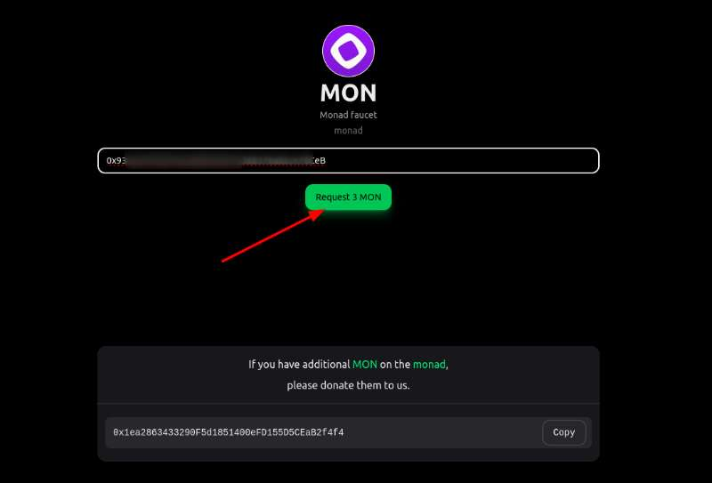
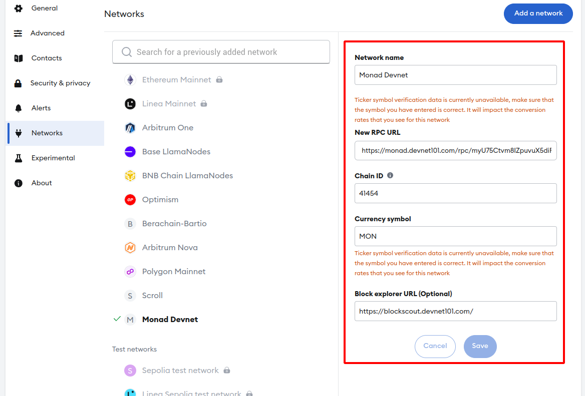

### Monad 101 中国巡回之旅

Monad 101 是一项旨在了解 Monad 技术和发展的活动，Monad 高度重视华语开发者的支持与参与， 因此 Monad 与 OpenBuild，HackQuest，登链，TinTinLand 携手举办本次 Monad 101 中国巡回活动，诚邀各位开发者、投资者及区块链生态爱好者，参与即将举行的 Monad 101 线下 Meetup 系列活动！此次活动将走进杭州、上海、成都和深圳四大城市，深入解读 Monad 区块链的核心技术与生态系统。


#### Workshop

现场将会有 Workshop 代码实操，可以抢先体验 Monad 的内部测试网，提前了解公测前的最新进展！

Workshop 内容包括：
1. Monad DApp 演示：将手把手教您如何在 Monad 上进行合约开发、测试及部署。
2. DApp 安全开发最佳实践：了解智能合约常见风险及规避措施，帮助您开发出更安全的 DApp。


#### 准备开发环境

体验测试网需要用到 [Scaffold-ETH](https://scaffoldeth.io/)，`Scaffold-ETH` 是一个开源的最新工具包，用于在以太坊区块链上构建去中心化应用程序。


##### 依赖

- [Node (>= v18.18)](https://nodejs.org/en/download/)
- Yarn ([v1](https://classic.yarnpkg.com/en/docs/install/) or [v2+](https://yarnpkg.com/getting-started/install))
- Git

##### 初始化项目

初始化比较耗时，可以提前初始化。

```bash
$ npx create-eth@0.0.55
 +-+-+-+-+-+-+-+-+-+-+-+-+-+-+
 | Create Scaffold-ETH 2 app |
 +-+-+-+-+-+-+-+-+-+-+-+-+-+-+

? Your project name: dapp101
? What solidity framework do you want to use? foundry


✔ 📁 Create project directory /home/web3/monad/docs/dapp101
✔ 🚀 Creating a new Scaffold-ETH 2 app in dapp101
✔ 📦 Installing dependencies with yarn, this could take a while
✔ 🪄 Formatting files
✔ 📡 Initializing Git repository and submodules


  Congratulations! Your project has been scaffolded! 🎉

  Next steps:

  cd dapp101

        Start the local development node
        yarn chain

        In a new terminal window, deploy your contracts
        yarn deploy

        In a new terminal window, start the frontend
        yarn start

  Thanks for using Scaffold-ETH 2 🙏, Happy Building!
```


##### 领水

本次活动的水龙头由 [HackQuest](https://www.hackquest.io/zh) 提供，水龙头地址： https://www.hackquest.io/zh/faucets/41454 , 一次可以领3 MON，足够完成一次合约部署。



##### 添加 Monad Devnet

网络名称：Monad Devnet 
RPC URL：https://monad.devnet101.com/rpc/myU75Ctvm8IZpuvuX5diRNZOOKXVgmQH 
ChainId：41454 
Token：MON
区块浏览器：https://blockscout.devnet101.com/ 



