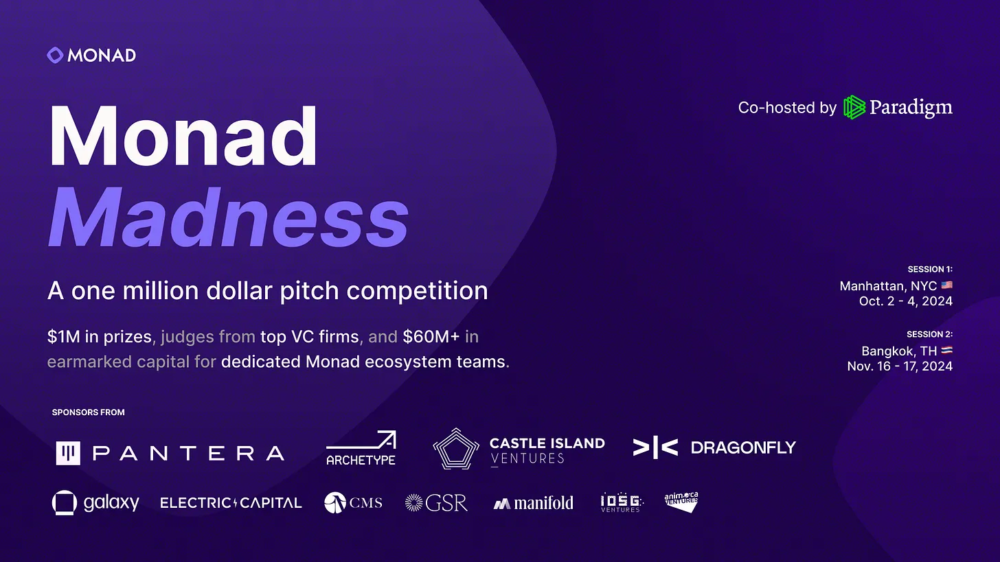
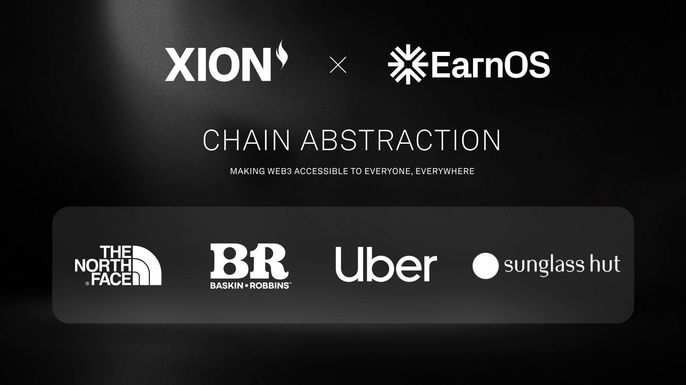
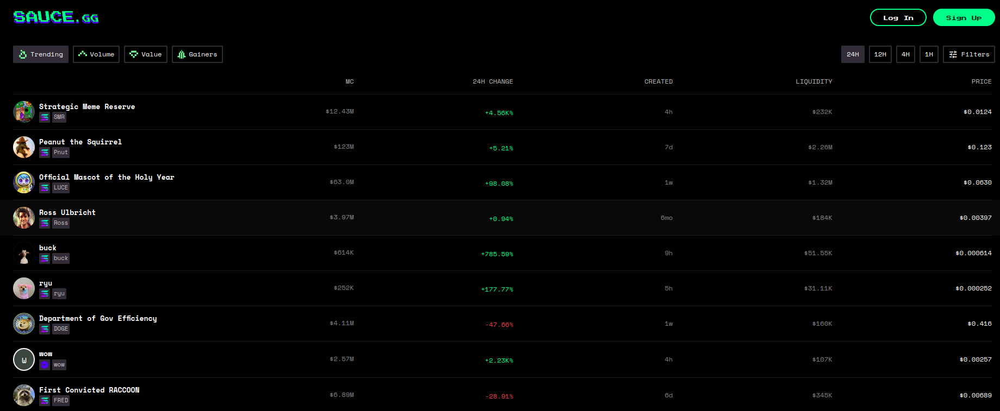
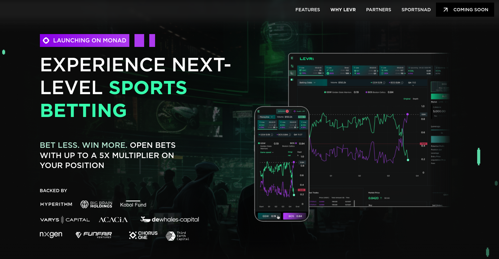
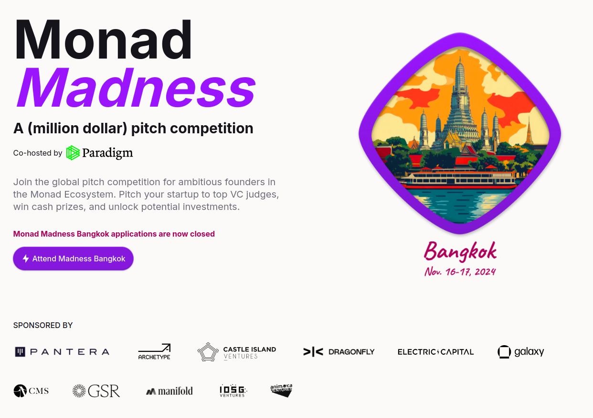
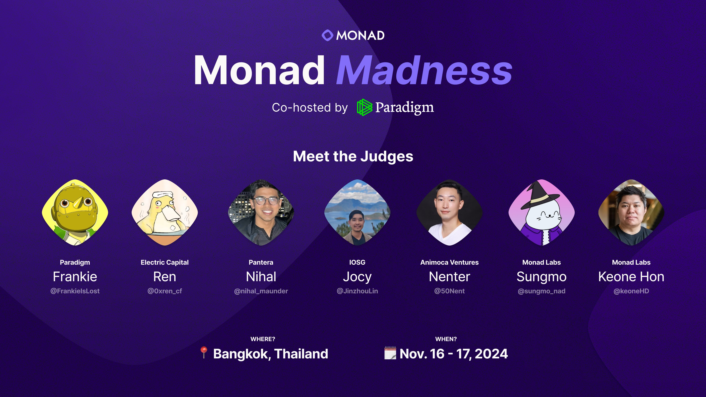

### Monad Madness NYC 项目精粹

**Monad Madness** 是由 **Monad Labs** 发起的一场高规格区块链项目路演比赛，旨在吸引全球最具创新力的 Web3 初创公司和团队，提供展示其项目的机会。此次活动的亮点在于其高达 **100 万美元**的奖金池和众多知名投资人的关注。

首场比赛于 2024 年 10 月在纽约举行，吸引了超过六十位投资人到场观摩，并收获了超过 6000 万美元的潜在投资意向。本场 Monad Madness NYC 共有6个参赛项目获奖，它们覆盖了区块链技术中的多个前沿领域。**EarnOS** 获得了第一名，它是一个基于链抽象的商业平台，致力于通过提高广告投放的投资回报率和用户互动渠道来革新数字广告业。**Sauce.GG** 荣获第二名，这是一个聚焦于 meme 文化的交易平台，捕捉了多链上 meme 币的文化精髓。**LEVR** 获得第三名，是一个将体育和金融结合的去中心化杠杆娱乐平台，提供链上杠杆投资选项。

此外，竞赛还设立了社区奖，表彰了如 **Hyperplex（聚焦流动性管理）**、**Plato** 和 **Symphony** 等项目，这些项目分别致力于解决 DeFi、流动性管理以及去中心化协作中的关键挑战。

#### 第一名：EarnOS，一个基于链抽象的商业平台

官网：https://beta.earnos.io/

推特：https://x.com/earnos_io

EarnOS 致力于在数字广告领域实现变革，通过去中心化的方式为品牌带来更高的投资回报率，同时为用户提供全新的价值获取渠道。EarnOS 利用链抽象技术降低了用户的上手门槛，使得用户只需通过邮箱登录即可进行操作。平台采用多样化的广告方式，包括社交媒体流量生成、定制化广告和 AR 沉浸式体验，并与 North Face 和 Uber 等公司合作，已吸引 20 万多名用户参与了品牌互动活动。

#### 第二名：Sauce.GG，一个专注于 meme 币的交易平台

官网：https://sauce.gg/

推特：https://x.com/saucegg_

以 Solana、ETH 和 Base 链为基础。Sauce.GG 不仅提供 meme 币的交易体验，还展示了每种 meme 币的文化核心，通过紧凑的页面设计和 meme 排行榜突显了 Monad 社区对 meme 文化的热情。该平台从多链支持和社区文化角度，展示了 Web3 的趣味和互动性。

#### 第三名：LEVR，一个去中心化杠杆娱乐平台

官网：https://www.levr.bet/

推特：https://x.com/LEVR_bet

LEVR 将体育娱乐与去中心化的投资策略相结合，允许用户在链上进行最高 5 倍杠杆的投资，并引入了基于预言机的清算机制，以确保交易的安全和公平。平台的核心是 MVP Vault，它作为自动化做市商（AMM）参与买入和赎回市场，使得用户能够与 LEVR 的池子进行交易。该项目为用户提供了流动性充足的交易体验，同时带来了有趣的杠杆化投注。

#### 社区奖：Hyperplex

Hyperplex 是一个专注于优化 DeFi 流动性管理的项目。它的目标是在不显著增加风险的前提下，提升资本效率和收益。Hyperplex 通过智能化的流动性管理和优化策略，帮助用户在 DeFi 领域中更有效地管理资金。

#### 社区奖：Plato

Plato 是一个聚焦于去中心化协作的项目。它通过创新的协作模式和激励机制，支持跨地域的团队合作，使得参与者能够更高效地共享知识和资源。Plato 旨在解决去中心化团队协作中的沟通与激励问题。

#### 社区奖：Symphony

Symphony 是一个去中心化的项目协作平台，旨在简化和提升团队间的协同工作效率。它提供了去中心化的项目管理和任务分配工具，使团队能够高效完成任务，适用于开发者、项目经理等在 Web3 环境下的团队。

Monad Madness 不仅为参赛团队提供了奖金，还旨在帮助其在 Web3 行业中获得更多的支持和认可。获奖团队能够接触到 Monad Labs 的资源和支持，包括行业指导、网络拓展以及资金对接等。参赛项目类型涵盖了从链抽象、DeFi（去中心化金融）、流动性管理到去中心化协作等各个领域，全面展示了区块链技术的多样化应用和未来潜力。

第二场 Monad Madness 将于 2024 年 11 月 16 日至 17 日在泰国曼谷举行，预计将有更多的投资人到场，并吸引更多的优秀团队参赛。活动详情：https://lu.ma/jt1t8gb6 

