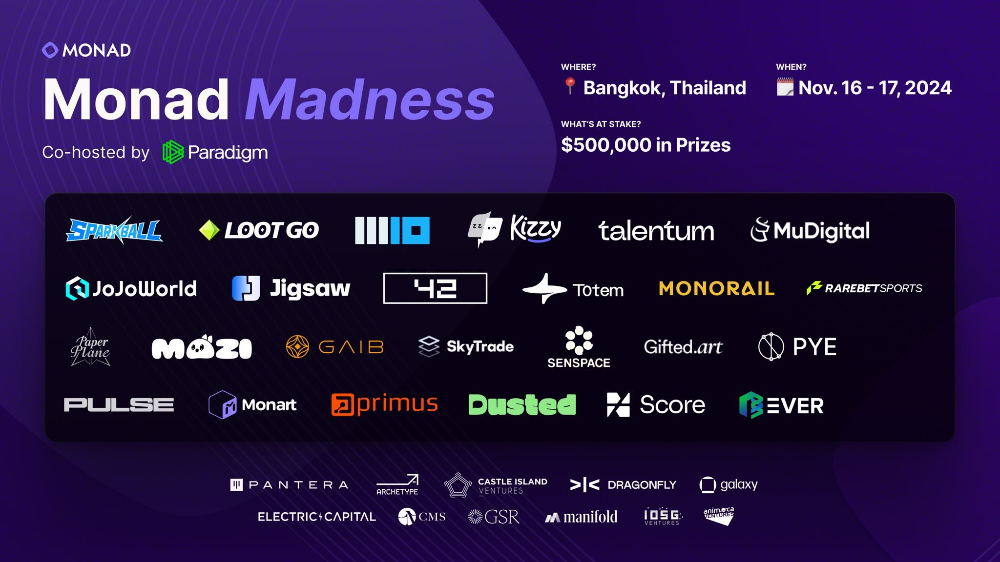

### Monad Madness Bangkok 回顾：激发创新的全球赛场

**Monad Madness** 是由 **Monad** 区块链和 **Paradigm** 联合举办的一场大型路演活动，旨在通过创新项目的展示和竞赛推动区块链生态的发展。活动的亮点之一是高达 100 万美元的奖金池以及超过 6000 万美元的生态专项资金，吸引了来自全球的初创团队参与，展示了许多前沿的区块链技术和应用。

近期，Monad Madness Bangkok 活动于 2024年11月16-17 日在曼谷举行，这场全球范围的竞赛吸引了众多优秀团队和顶级投资人，为 Monad 生态系统展现了广阔的潜力和未来。本次竞赛共有25个团队争夺 50 万美元的奖金和顶级风险投资的关注，每支团队不仅需在短时间内阐述项目的独特性，还需现场回答评委提出的尖锐问题，这一紧凑的赛制设计对参赛者的临场表现提出了更高的要求，也为比赛增添了紧张感和戏剧性。经过激烈的角逐，最终共有 6 个项目获得价值 47.5 万美金奖励，分别为：Dusted、Pulse、Mozi、RareBetSports、Kizzy、Sparkball。

